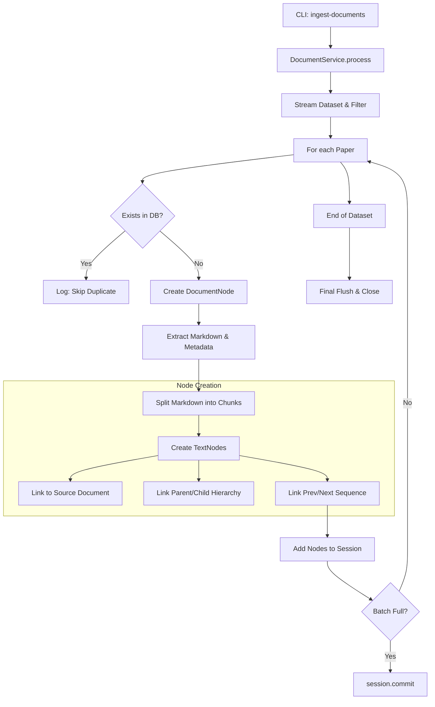

# Services logic

## Document ingestion

```mermaid
graph TD
    A[CLI: ingest-documents] --> B[DocumentService.process]
    B --> C[Stream Dataset & Filter]
    C --> D[For each Paper]
    D --> E{Exists in DB?}

    E -->|Yes| G[Log: Skip Duplicate]
    E -->|No| H[Create DocumentNode]

    H --> I[Extract Markdown & Metadata]
    I --> J[Split Markdown into Chunks]

    subgraph Chunking_Logic [Node Creation]
    J --> K[Create TextNodes]
    K --> K1[Link to Source Document]
    K --> K2[Link Parent/Child Hierarchy]
    K --> K3[Link Prev/Next Sequence]
    end

    K3 --> L[Add Nodes to Session]
    L --> M{Batch Full?}
    M -->|Yes| N[session.commit]
    M -->|No| D

    D --> O[End of Dataset]
    O --> P[Final Flush & Close]
```
